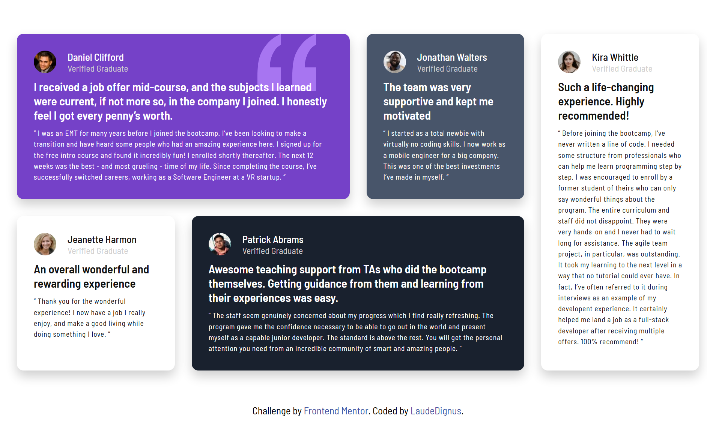

# Frontend Mentor - Testimonials Grid Section Solution

This project is a complete solution to the [Testimonials grid section challenge](https://www.frontendmentor.io/challenges/testimonials-grid-section-Nnw6J7Un7) on Frontend Mentor. The goal: sharpen HTML5/CSS skills by building a responsive testimonial grid using vanilla code.

## Table of Contents

- [Overview](#overview)  
  - [The challenge](#the-challenge)  
  - [Screenshot](#screenshot)  
  - [Links](#links)  
- [My process](#my-process)  
  - [Built with](#built-with)  
  - [What I learned](#what-i-learned)  
  - [Continued development](#continued-development)  
  - [Useful resources](#useful-resources)  
- [Author](#author)  
- [Acknowledgments](#acknowledgments)  

---

## Overview

### The challenge

The main objective was to deliver an optimized and fluid layout adapting perfectly to different screen sizes, mastering CSS Grid for an elegant and efficient design.

### Screenshot

### Links

- Solution URL: [GitHub Repository](https://github.com/LaudeDignus/testimonials-grid-section.git)  
- Live Site URL: [Live Demo](https://miwodi-testimonial-grid-section.netlify.app/)  

---

## My process

### Built with

- Semantic HTML5  
- Vanilla CSS3  
- CSS Grid (notably `grid-template-areas` and `grid-template-columns`)  
- Mobile-first workflow  

### What I learned

I dug deep into advanced CSS Grid concepts, especially `grid-template-areas` which took some time to fully grasp. Handling responsiveness with `grid-template-columns` was a significant challenge, involving several iterations to achieve a smooth experience across all devices.

This project also allowed me to deepen my understanding of CSS architecture methodologies like BEM and ITCSS, which greatly improve long-term maintainability and code clarity.

### Continued development

I aim to keep improving scalability, maintainability, and most importantly, accessibility — the essential pillars for writing clean, professional, and sustainable code. Mastering these will make my projects more robust and easier to maintain.

### Useful resources

- [CSS Grid Guide - MDN](https://developer.mozilla.org/en-US/docs/Web/CSS/CSS_Grid_Layout) — An essential resource for mastering CSS Grid.  
- [BEM Methodology](http://getbem.com/) — For organizing and naming CSS classes properly.  
- [ITCSS](https://itcss.io/) — For scalable and clear CSS architecture.  

---

## Author

- GitHub - [LaudeDignus](https://github.com/LaudeDignus)  
- Frontend Mentor - [@LaudeDignus](https://www.frontendmentor.io/profile/LaudeDignus)  

---

## Acknowledgments

This project was completed solo, but extensive documentation and community resources were instrumental in understanding advanced concepts.

---
